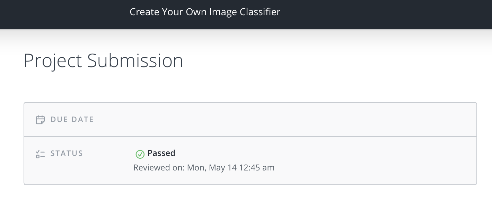

# Create Your Own Image Classifier Review

### Meets Specifications 

Student,

Going over your project, it is really well done. I believe you must be working with PyTorch for the first time and it can be quite intimidating at times. I would highly suggest taking a look at [these lectures](https://documents.epfl.ch/users/f/fl/fleuret/www/dlc/), especially the [PyTorch tensors](https://documents.epfl.ch/users/f/fl/fleuret/www/videos/dlc-video-1b-tensors.mp4). These are one of the best resources to learn PyTorch along with theoretical constructs. 

Further, you should definitely go through [Justin's](https://cs.stanford.edu/people/jcjohns/) introduction to [PyTorch](https://github.com/jcjohnson/pytorch-examples).

**Further Reading:** Often as with new paradigm learning on experience of others are really helpful in the long-run. [This](https://towardsdatascience.com/a-practitioners-guide-to-pytorch-1d0f6a238040), [this](http://ruotianluo.github.io/2017/02/10/pytorch-attempt/) and [this](https://ikhlestov.github.io/pages/machine-learning/pytorch-notes/) are some of the best gems I have used over the past year to learn cool tips and hacks.

### Files Submitted 

The submission includes all required files. (Model checkpoints not required.)

### Part 1 - Development Notebook 

All the necessary packages and modules are imported in the first cell of the notebook

torchvision transforms are used to augment the training data with random scaling, rotations, mirroring, and/or cropping

The training, validation, and testing data is appropriately cropped and normalized

The data for each set is loaded with torchvision's DataLoader

The data for each set (train, validation, test) is loaded with torchvision's ImageFolder

A pretrained network such as VGG16 is loaded from torchvision.models and the parameters are frozen

A new feedforward network is defined for use as a classifier using the features as input

The parameters of the feedforward classifier are appropriately trained, while the parameters of the feature network are left static

During training, the validation loss and accuracy are displayed

The network's accuracy is measured on the test data

The trained model is saved as a checkpoint along with associated hyperparameters and the class_to_idx dictionary

There is a function that successfully loads a checkpoint and rebuilds the model

The predict function successfully takes the path to an image and a checkpoint, then returns the top K most probably classes for that image

The process_image function successfully converts a PIL image into an object that can be used as input to a trained model

A matplotlib figure is created displaying an image and its associated top 5 most probable classes with actual flower names

### Part 2 - Command Line Application 

train.py successfully trains a new network on a dataset of images and saves the model to a checkpoint

The training loss, validation loss, and validation accuracy are printed out as a network trains

The training script allows users to choose from at least two different architectures available from torchvision.models

The training script allows users to set hyperparameters for learning rate, number of hidden units, and training epochs

The training script allows users to choose training the model on a GPU

The predict.py script successfully reads in an image and a checkpoint then prints the most likely image class and it's associated probability

The predict.py script allows users to print out the top K classes along with associated probabilities

The predict.py script allows users to load a JSON file that maps the class values to other category names

The predict.py script allows users to use the GPU to calculate the predictions

---

