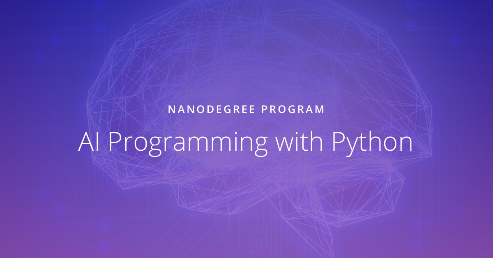

 

# Udacity AI Programming with Python Nanodegree

 

**Periode: April 2018 - May 2018.**

 

Course content: Python, NumPy, Pandas, Seaborn, PyTorch, linear algebra and deep learning.

 

------

*Last update: 2 September 2019*